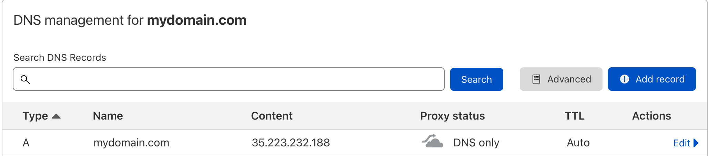

# Kusk with cert-manager

This repository sets up TLS for Kusk Gateway using:
- Cloudflare as DNS provider
- Let's Encrypt as certificate issuer
- Cert Manager to setup TLS secrets and rotate them when expired

### 1. Get an API token from Cloudflare

You will need an API token from Cloudflare to allow cert-manager to put a CNAME in your DNS records to verify that the domain belongs to you. 

In Cloudflare for to **My Profile** -> **API Tokens** -> **Create Token** and click on **Edit Zone DNS** template to use. 

### 2. Apply the Kubernetes secret containing the Cloudflare token

Once the API key is created, copy it and add it to [`secret.yaml`](./cert-manager/secret.yaml) replacing `$CLOUDFLARE_API_TOKEN` by the token. 

```sh
kubectl apply -f cert-manager/secret.yaml
```

### 3. Add an `A` record in your DNS

Get the Kusk LoadBalancer's IP address and add an `A` record in your DNS records in Cloudflare: 

```sh
kusk ip
35.223.232.188
```



### 4. Install cert-manager in the cluster

Follow the instruction from Cert Manager [installation guide](https://cert-manager.io/docs/installation/).

### 5. Apply the Let's Encrypt Issuer

In [`issuer.yaml`](./cert-manager/issuer.yaml):
- Update `$EMAIL_ADDRESS` with your own email address

And apply the Issuer to the cluster:

```sh 
kubectl apply -f cert-manager/issuer.yaml
kubectl wait --for=condition=ready issuer letsencrypt-prod --namespace default --timeout 2m
```
### 6. Apply the Certificate for your domain

In [`certificate.yaml`](./cert-manager/certificate.yaml):
- Update `$DOMAIN_NAME` with the domain you used in step 2.

And apply the Certificate to the cluster:

```sh 
kubectl apply -f cert-manager/certificate.yaml
kubectl wait --for=condition=ready certificate letsencrypt-cert --namespace default --timeout 2m
```

### 7. Visit your TLS encrypted domain 

You should now have your domain protected with `https`.

```sh
curl https://mydomain.com
```

## Reference

- https://cert-manager.io/docs/configuration/acme/dns01/cloudflare/


