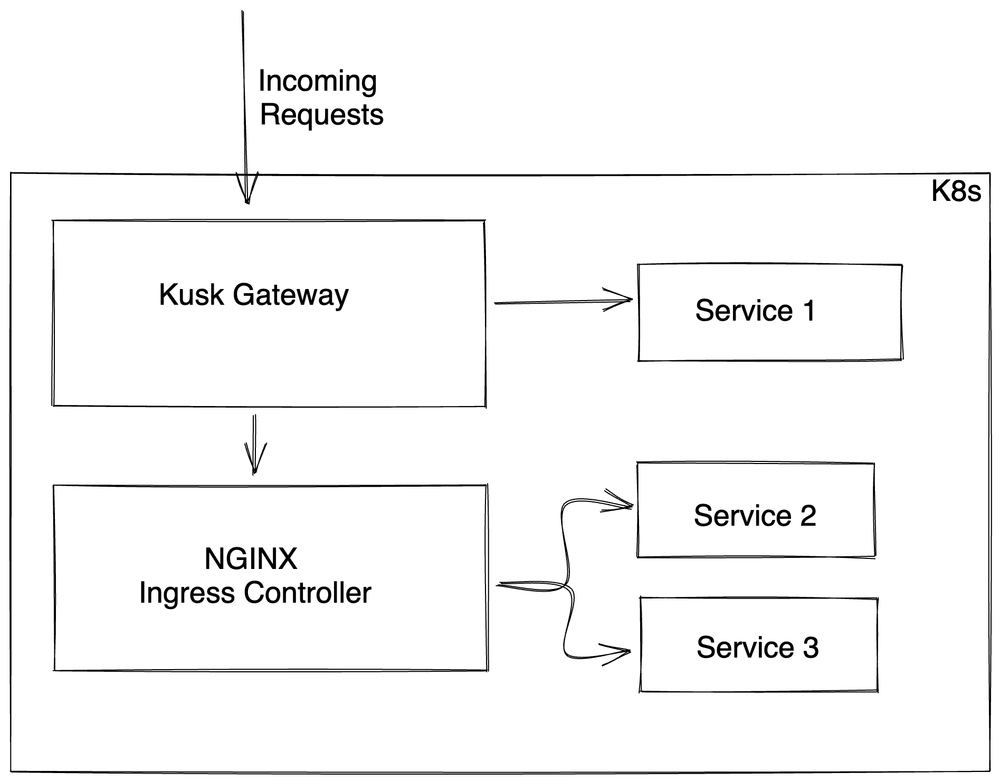

# Installing Kusk Gateway with NGinx

This example shows how to have an installation of Kusk Gateway with NGinx. This example might be helpful when transitioning from using NGinx's Ingress Controller to Kusk Gateway's, or if you want to reap the benefits of automating OpenAPI deployment with Kusk while still using your Ingress Controller of choice.

## Setup

This diagram shows how the requests are handled in this example when combining the two Ingress Controllers:



Kusk Gateway receives all the incoming requests to the cluster. `Service 1` is a new application that is connected directly to Kusk Gateway while `Service 2` and `Service 3` are still connected to NGINX, so to access them the requests will be routed to Kusk Gateway. 

## How to run this example 

### 1. Install Kusk CLI and the Kusk Ingress Controller

Follow the installation instructions here: https://docs.kusk.io/quick-links/install

### 2. Install NGINX Ingress Controller

```sh
helm upgrade --install ingress-nginx ingress-nginx \
  --repo https://kubernetes.github.io/ingress-nginx \
  --namespace ingress-nginx --create-namespace
```

### 3. Install the different applications in the cluster

```sh
kubectl apply -f kubernetes
```

### 4. Configure Kusk Gateway to route the traffic

In the OpenAPI definition you can see the Kusk policies under `x-kusk` section. You'll see a Kusk Policy at the root level, which is applied globally to all the paths, and also some rules at a path level, which in case the root and the path level describe the same policy, the path level one precedes. 

Apply the Kusk definition: 

```sh
kusk deploy -i openapi.yaml
```

### 5. Test the application in your cluster

Now test the 3 applications in the cluster. 

First get the External IP address for Kusk with: 

```sh 
kusk ip 
12.34.56.78
```

Call the three different apps: 

```sh 
http 12.34.56.78/app1
App1 served directly from Kusk Gateway
```

```sh
http 12.34.56.78/app2
App2 served by NGINX through Kusk Gateway
```

```sh
http 12.34.56.78/app3
App3 served by NGINX through Kusk Gateway
```